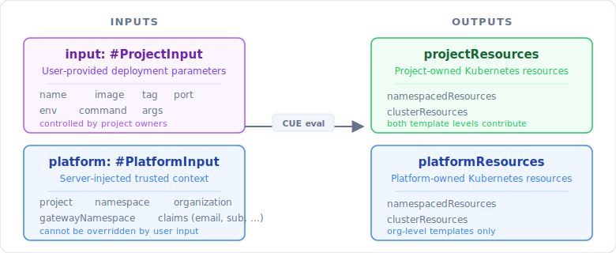
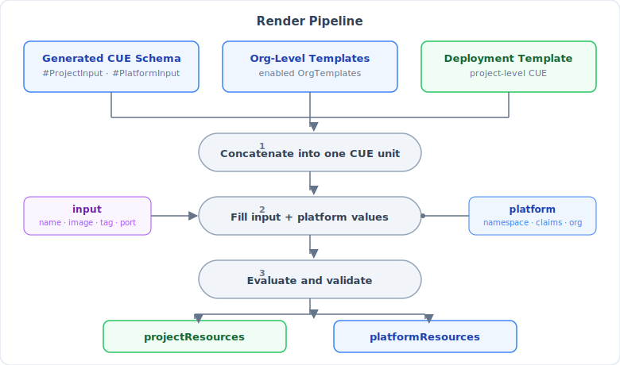

# Advanced User Guide

This guide covers the full RPC surface of the holos-console API and walks
through a concrete end-to-end scenario: a platform engineer defines an
org-level template that constrains and augments every deployment, a project
engineer creates a project-level template for a specific workload, and a
project owner deploys an instance of that workload.

---

## RPC Services Reference

The console exposes eight ConnectRPC services. All services require a valid
OIDC Bearer token on every request (`Authorization: Bearer <id_token>`).
Permission requirements below are the minimum role that grants access without
an explicit override grant.

### OrganizationService

An _organization_ is a top-level administrative boundary backed by a
Kubernetes Namespace. Every project, deployment template, org-level template,
and deployment belongs to an organization.

| RPC | Required Permission | Description |
|-----|-------------------|-------------|
| `ListOrganizations` | Authenticated | Returns all organizations the caller has any role on. |
| `GetOrganization` | `PERMISSION_ORGANIZATIONS_READ` | Returns a single organization including its sharing grants and the caller's effective role. |
| `CreateOrganization` | `PERMISSION_ORGANIZATIONS_CREATE` | Creates an organization backed by a K8s Namespace. Controlled by `--disable-org-creation` / `--org-creator-users` / `--org-creator-roles`. |
| `UpdateOrganization` | `PERMISSION_ORGANIZATIONS_WRITE` | Updates display name or description. |
| `DeleteOrganization` | `PERMISSION_ORGANIZATIONS_DELETE` | Deletes the org and its backing Namespace. |
| `UpdateOrganizationSharing` | `PERMISSION_ORGANIZATIONS_ADMIN` | Replaces the per-user and per-role sharing grants on the org. |
| `UpdateOrganizationDefaultSharing` | `PERMISSION_ORGANIZATIONS_ADMIN` | Sets the default grants applied to every new project created in this org. |
| `GetOrganizationRaw` | `PERMISSION_ORGANIZATIONS_READ` | Returns the verbatim JSON of the backing Kubernetes Namespace for debugging. |

### ProjectService

A _project_ is a Kubernetes Namespace scoped to an organization. Projects
hold secrets, deployment templates, and deployments. RBAC grants on a project
cascade from the parent organization: org-level OWNERs have full access to
all projects in the org.

| RPC | Required Permission | Description |
|-----|-------------------|-------------|
| `ListProjects` | Authenticated | Returns all projects the caller has any role on. Accepts an optional `organization` filter. |
| `GetProject` | `PERMISSION_PROJECTS_READ` | Returns a single project including sharing grants and the caller's effective role. |
| `CreateProject` | `PERMISSION_PROJECTS_CREATE` | Creates a project Namespace in the org. Automatically applies any mandatory org-level templates. |
| `UpdateProject` | `PERMISSION_PROJECTS_WRITE` | Updates display name or description. |
| `DeleteProject` | `PERMISSION_PROJECTS_DELETE` | Deletes the project and its backing Namespace. |
| `UpdateProjectSharing` | `PERMISSION_PROJECTS_ADMIN` | Replaces the per-user and per-role sharing grants on the project. |
| `UpdateProjectDefaultSharing` | `PERMISSION_PROJECTS_ADMIN` | Sets the default grants applied to every new secret created in this project. |
| `GetProjectRaw` | `PERMISSION_PROJECTS_READ` | Returns the verbatim JSON of the backing Kubernetes Namespace. |

### ProjectSettingsService

Per-project feature flags. Deployment features (templates, deployments) are
disabled by default and must be explicitly enabled by an org-level OWNER.

| RPC | Required Permission | Description |
|-----|-------------------|-------------|
| `GetProjectSettings` | `PERMISSION_PROJECT_SETTINGS_READ` | Returns the current settings for a project. Returns defaults (`deployments_enabled: false`) if not yet set. |
| `UpdateProjectSettings` | `PERMISSION_PROJECT_DEPLOYMENTS_ENABLE` | Enables or disables deployment features. Granted only to org-level OWNERs. |
| `GetProjectSettingsRaw` | `PERMISSION_PROJECT_SETTINGS_READ` | Returns the verbatim JSON of the backing Namespace for debugging. |

### SecretsService

Kubernetes Secrets with per-secret RBAC. Secrets are scoped to a project
namespace. The service only operates on Secrets with the
`app.kubernetes.io/managed-by: console.holos.run` label. Deployments can
reference secrets as container environment variables via `SecretKeyRef`.

| RPC | Required Permission | Description |
|-----|-------------------|-------------|
| `ListSecrets` | `PERMISSION_SECRETS_LIST` | Lists secrets in the project, including metadata and grants. Secret data values are not returned. |
| `GetSecret` | `PERMISSION_SECRETS_READ` | Returns secret data for a single secret. Requires an explicit sharing grant on the secret. |
| `CreateSecret` | `PERMISSION_SECRETS_WRITE` | Creates a new managed secret with sharing grants. |
| `UpdateSecret` | `PERMISSION_SECRETS_WRITE` | Replaces the entire data map of a secret. |
| `DeleteSecret` | `PERMISSION_SECRETS_DELETE` | Deletes a managed secret. |
| `UpdateSharing` | `ROLE_OWNER` on secret | Replaces the per-user and per-role sharing grants on the secret without touching its data. |
| `GetSecretRaw` | `PERMISSION_SECRETS_READ` | Returns the verbatim JSON of the backing Kubernetes Secret. |

### TemplateService (deployment templates — project scope)

_Deployment templates_ are project-scoped CUE programs that define what
Kubernetes resources a deployment creates. A template declares what
parameters it accepts (`#ProjectInput`) and what resources it produces
(`projectResources`). Templates are stored as Kubernetes ConfigMaps in the
project namespace.

| RPC | Required Permission | Description |
|-----|-------------------|-------------|
| `ListTemplates` | `PERMISSION_TEMPLATES_LIST` | Lists all templates in a scope. |
| `GetTemplate` | `PERMISSION_TEMPLATES_READ` | Returns a single template including its CUE source and default values. |
| `CreateTemplate` | `PERMISSION_TEMPLATES_WRITE` | Creates a new template in the scope. |
| `UpdateTemplate` | `PERMISSION_TEMPLATES_WRITE` | Updates the CUE source, display name, description, or default values of an existing template. |
| `DeleteTemplate` | `PERMISSION_TEMPLATES_DELETE` | Deletes a template. |
| `RenderDeploymentTemplate` | `PERMISSION_TEMPLATES_READ` | Renders a CUE template against supplied inputs and returns the resulting Kubernetes manifests as YAML and JSON. Does not create or modify any deployment — useful for previewing during authoring. |

### TemplateService (platform templates — org and folder scope)

_Platform templates_ are organization- or folder-scoped CUE programs
authored by platform engineers. They run alongside every deployment template
at render time and can contribute platform-managed resources (`platformResources`)
and enforce constraints on what project templates are allowed to produce. They
are stored as Kubernetes ConfigMaps in the org or folder namespace.

A platform template may be marked **mandatory** (applied to every project
namespace at project creation time) and/or **enabled** (unified with the
deployment template at deploy time). New templates start disabled.

| RPC | Required Permission | Description |
|-----|-------------------|-------------|
| `ListTemplates` | `PERMISSION_TEMPLATES_LIST` | Lists all platform templates in the scope. |
| `GetTemplate` | `PERMISSION_TEMPLATES_READ` | Returns a single platform template including its CUE source. |
| `CreateTemplate` | `PERMISSION_TEMPLATES_WRITE` | Creates a new platform template. Starts disabled and non-mandatory by default. |
| `UpdateTemplate` | `PERMISSION_TEMPLATES_WRITE` | Updates the CUE source, display name, description, or the mandatory/enabled flags. |
| `DeleteTemplate` | `PERMISSION_TEMPLATES_DELETE` | Deletes a platform template. |
| `RenderDeploymentTemplate` | `PERMISSION_TEMPLATES_READ` | Renders the platform template CUE against supplied inputs and returns manifests as YAML and JSON. Does not create any deployment. |

> All `TemplateService` write operations require `PERMISSION_TEMPLATES_WRITE`.
> The unified `TemplateCascadePerms` table applies the same role→permission mapping
> (VIEWER=read, EDITOR=read/write, OWNER=full) at every scope level (ADR 021 Decision 2).

### DeploymentService

A _deployment_ is a running instance of a deployment template. Creating a
deployment renders the project-level template (unified with all enabled
org-level templates) and applies the resulting manifests to Kubernetes via
server-side apply.

| RPC | Required Permission | Description |
|-----|-------------------|-------------|
| `ListDeployments` | `PERMISSION_DEPLOYMENTS_LIST` | Lists all deployments in a project. |
| `GetDeployment` | `PERMISSION_DEPLOYMENTS_READ` | Returns the stored deployment parameters. |
| `CreateDeployment` | `PERMISSION_DEPLOYMENTS_WRITE` | Renders the template with the supplied parameters and applies the manifests to Kubernetes. |
| `UpdateDeployment` | `PERMISSION_DEPLOYMENTS_WRITE` | Re-renders and re-applies the deployment with updated parameters (e.g. a new image tag). |
| `DeleteDeployment` | `PERMISSION_DEPLOYMENTS_DELETE` | Deletes the deployment record and removes the associated Kubernetes resources. |
| `GetDeploymentStatus` | `PERMISSION_DEPLOYMENTS_READ` | Returns live status from the Kubernetes Deployment: replica counts, conditions, and per-pod phase. |
| `GetDeploymentLogs` | `PERMISSION_DEPLOYMENTS_LOGS` | Returns recent container log output. |
| `ListNamespaceSecrets` | `PERMISSION_DEPLOYMENTS_READ` | Lists Secrets available in the project namespace for use as `SecretKeyRef` env var sources. |
| `ListNamespaceConfigMaps` | `PERMISSION_DEPLOYMENTS_READ` | Lists ConfigMaps available in the project namespace for use as `ConfigMapKeyRef` env var sources. |
| `GetDeploymentRenderPreview` | `PERMISSION_DEPLOYMENTS_READ` | Returns the CUE template source, platform input, project input, and rendered YAML/JSON for a live deployment. Used by the UI to display the template preview on the deployment detail page. |

### VersionService

| RPC | Required Permission | Description |
|-----|-------------------|-------------|
| `GetVersion` | Authenticated | Returns the server version, git commit, tree state, and build date. |

---

## Template Architecture

The console separates responsibility across two template levels that compose
at render time.


### Separation of Inputs

Every CUE template receives two top-level fields:

- **`input`** — parameters supplied by the project owner at deploy time:
  name, image, tag, port, env vars, command, args. Typed as `#ProjectInput`.
  Project owners control these values.

- **`platform`** — trusted context injected by the console from authenticated
  server state: project name, resolved Kubernetes namespace,
  gateway namespace, organization name, and OIDC claims. Typed as
  `#PlatformInput`. Platform engineers and the server control these values;
  they cannot be overridden by user input.

### Separation of Outputs

A rendered template produces resources in two collections:

- **`projectResources`** — resources owned by the project team:
  `Deployments`, `Services`, `ServiceAccounts`, etc. Both template levels
  can define values here. The CUE constraint pattern lets org-level templates
  restrict which Kinds the project template may produce.

- **`platformResources`** — resources owned by the platform team:
  `HTTPRoute`, network policies, etc. Only org-level templates are allowed
  to define these — the project-level render path never reads `platformResources`
  from a deployment template. This is a hard boundary enforced in Go code
  (ADR 016 Decision 8).



### How Templates Compose

When a deployment is created or updated the console runs the render pipeline:



In detail:

1. The console loads the deployment template (project-level CUE).
2. It loads all **enabled** org-level templates for the organization.
3. It prepends the generated CUE schema (`#ProjectInput`, `#PlatformInput`,
   `#Claims`, `#EnvVar`, `#KeyRef`) from `api/v1alpha2`.
4. It concatenates all sources into one CUE compilation unit.
5. It fills `input` from the deployment parameters and `platform` from
   authenticated server context.
6. It reads `projectResources.namespacedResources`,
   `projectResources.clusterResources`, `platformResources.namespacedResources`,
   and `platformResources.clusterResources` from the evaluated value.
7. It validates each resource against a safety allowlist and applies all
   resources to Kubernetes in a single server-side apply pass.

Because all templates are compiled together, an org-level template can impose
CUE constraints on `projectResources.namespacedResources` — for example,
closing the struct to a specific set of allowed Kinds. Any project template
that violates the constraint gets a CUE evaluation error before any Kubernetes
call is attempted.

### Three Enforcement Layers

| Layer | Mechanism | When |
|-------|-----------|------|
| **CUE (early)** | Org template closes `projectResources.namespacedResources` struct; project template gets an evaluation error for any unlisted Kind | At CUE evaluation time, before any Go or Kubernetes call |
| **Go safety net** | `allowedKindSet` in `render.go` validates every Kind after evaluation | After CUE evaluation, before Kubernetes apply |
| **Go hard boundary** | The project-level render path does not read `platformResources` | Unconditionally, at render time |

---

## End-to-End Walkthrough: Deploying go-httpbin

This walkthrough uses [go-httpbin](https://github.com/mccutchen/go-httpbin),
a lightweight HTTP testing service, as the example workload. It follows the
full lifecycle across three personas:

1. **Platform engineer** — defines an org-level template that provides an
   HTTPRoute for every deployment and constrains which resource Kinds project
   templates may produce.
2. **Project engineer** — creates a project and writes a project-level
   deployment template for go-httpbin.
3. **Project owner** — deploys an instance and verifies it is running.

Assume an organization named `my-org` already exists and the platform engineer
has OWNER access to it.

---

### Step 1 — Enable Deployments on the Project (Platform Engineer)

Deployment features are disabled by default. Before a project engineer or
project owner can use templates, an org-level OWNER must enable them.

1. Navigate to **Organizations > my-org > Projects** and click **Create Project**.
   Fill in the form:
   - **Name**: `httpbin-project`
   - **Display Name**: `HTTPBin Test Project`

2. Open the new project's **Settings** page and toggle **Deployments Enabled**
   to on. (This calls `UpdateProjectSettings` with `deployments_enabled: true`.)

---

### Step 2 — Create the Org-Level Template (Platform Engineer)

The org-level template does two things:

1. **Provides the `HTTPRoute`** in `platformResources` so the gateway routes
   external traffic to the deployment's `Service`.
2. **Closes `projectResources.namespacedResources`** to prevent project
   templates from producing any resource Kind other than `Deployment`,
   `Service`, and `ServiceAccount`.

Navigate to **Organizations > my-org > Platform Templates** and click
**Create Platform Template**. Fill in the form fields:

| Field | Value |
|-------|-------|
| **Name** | `httproute-and-constraints` |
| **Display Name** | `HTTPRoute + Kind Constraints` |
| **Description** | Provides external access via HTTPRoute and restricts project resource Kinds. |
| **Mandatory** | unchecked |
| **Enabled** | unchecked (we will enable after preview) |

Paste the following CUE into the **Template** editor. This is the canonical
go-httpbin org-level example — an identical version is embedded in the server
at `console/templates/example_httpbin_platform.cue`.

```cue
// Org-level template — evaluated at organization scope.
// Any changes here affect every deployment in the org.

input: #ProjectInput & {
    port: >0 & <=65535 | *8080
}
platform: #PlatformInput

// ── Platform resources (managed by the platform team) ───────────────────

platformResources: {
    namespacedResources: (platform.namespace): {
        HTTPRoute: (input.name): {
            apiVersion: "gateway.networking.k8s.io/v1"
            kind:       "HTTPRoute"
            metadata: {
                name:      input.name
                namespace: platform.namespace
                labels: {
                    "app.kubernetes.io/managed-by": "console.holos.run"
                    "app.kubernetes.io/name":       input.name
                }
            }
            spec: {
                parentRefs: [{
                    group:     "gateway.networking.k8s.io"
                    kind:      "Gateway"
                    namespace: platform.gatewayNamespace
                    name:      "default"
                }]
                rules: [{
                    backendRefs: [{
                        name: input.name
                        port: 80
                    }]
                }]
            }
        }
    }
    clusterResources: {}
}

// ── Project resource constraints (enforced by the platform team) ─────────

// Close projectResources.namespacedResources so that every namespace bucket
// may only contain Deployment, Service, or ServiceAccount. Using close() with
// optional fields is the correct CUE pattern: the close() call marks the
// struct as closed (no additional fields allowed), and the ? marks each
// listed field as optional (a namespace bucket need not contain all three).
// Any unlisted Kind key — such as RoleBinding — is a CUE constraint
// violation at evaluation time, before any Kubernetes API call.
projectResources: namespacedResources: [_]: close({
    Deployment?:     _
    Service?:        _
    ServiceAccount?: _
})
```

#### Preview the Org-Level Template

Before enabling the template, use the **Render Preview** button to verify the
output. The preview fills in representative `platform` and `input` values:

Platform input (filled by the server at deploy time):

```cue
platform: {
    project:          "httpbin-project"
    namespace:        "holos-prj-httpbin-project"
    gatewayNamespace: "istio-ingress"
    organization:     "my-org"
    claims: {
        iss:            "https://dex.example.com"
        sub:            "user-123"
        exp:            9999999999
        iat:            1700000000
        email:          "platform@example.com"
        email_verified: true
    }
}
```

Project input (filled by the project owner at deploy time):

```cue
input: {
    name:  "httpbin"
    image: "ghcr.io/mccutchen/go-httpbin"
    tag:   "2.21.0"
    port:  8080
}
```

The rendered output should contain the `HTTPRoute` manifest. When the output
looks correct, edit the template and check **Enabled** to activate it for
all deployments in the org.

---

### Step 3 — Create the Project-Level Deployment Template (Project Engineer)

The project engineer creates a template that produces the three resource Kinds
allowed by the org constraint: `ServiceAccount`, `Deployment`, and `Service`.
The `HTTPRoute` is omitted — the org-level template provides it.

Navigate to the project's **Deployment Templates** page and click
**Create Deployment Template**. Fill in the form fields:

| Field | Value |
|-------|-------|
| **Name** | `go-httpbin` |
| **Display Name** | `go-httpbin` |
| **Description** | Deploys mccutchen/go-httpbin. GET /get returns 200 — useful as a health-check target. |
| **Default Image** | `ghcr.io/mccutchen/go-httpbin` |
| **Default Tag** | `2.21.0` |
| **Default Port** | `8080` |

Paste the following CUE into the **Template** editor:

```cue
// Project-level deployment template for go-httpbin.
// Produces: ServiceAccount, Deployment, Service.
// Allowed by the org constraint: Deployment, Service, ServiceAccount.
//
// This is the canonical go-httpbin example — an identical version is
// embedded in the server at console/templates/example_httpbin.cue.

// Use generated type definitions from api/v1alpha2 (prepended by renderer).
input: #ProjectInput & {
    name:  =~"^[a-z][a-z0-9-]*$" // DNS label
    image: string | *"ghcr.io/mccutchen/go-httpbin"
    tag:   string | *"2.21.0"
    port:  >0 & <=65535 | *8080
}
platform: #PlatformInput

// _labels are the standard labels required on every resource.
// app.kubernetes.io/managed-by MUST equal "console.holos.run" or the
// render will be rejected.
_labels: {
    "app.kubernetes.io/name":       input.name
    "app.kubernetes.io/managed-by": "console.holos.run"
}

// _annotations are standard annotations applied to every resource.
_annotations: {
    "console.holos.run/deployer-email": platform.claims.email
}

// #Namespaced constrains namespaced resource struct keys to match resource metadata.
// Structure: namespaced.<namespace>.<Kind>.<name>
#Namespaced: [Namespace=string]: [Kind=string]: [Name=string]: {
    kind: Kind
    metadata: {
        name:      Name
        namespace: Namespace
        ...
    }
    ...
}

// #Cluster constrains cluster-scoped resource struct keys to match resource metadata.
#Cluster: [Kind=string]: [Name=string]: {
    kind: Kind
    metadata: {
        name: Name
        ...
    }
    ...
}

projectResources: {
    namespacedResources: #Namespaced & {
        (platform.namespace): {
            // ServiceAccount provides a Kubernetes identity for the pods.
            ServiceAccount: (input.name): {
                apiVersion: "v1"
                kind:       "ServiceAccount"
                metadata: {
                    name:        input.name
                    namespace:   platform.namespace
                    labels:      _labels
                    annotations: _annotations
                }
            }

            // Deployment runs the go-httpbin container.
            // go-httpbin listens on port 8080 by default and needs no special
            // command or args — the image's default entrypoint works.
            Deployment: (input.name): {
                apiVersion: "apps/v1"
                kind:       "Deployment"
                metadata: {
                    name:        input.name
                    namespace:   platform.namespace
                    labels:      _labels
                    annotations: _annotations
                }
                spec: {
                    replicas: 1
                    selector: matchLabels: "app.kubernetes.io/name": input.name
                    template: {
                        metadata: labels: _labels
                        spec: {
                            serviceAccountName: input.name
                            containers: [{
                                name:  input.name
                                image: input.image + ":" + input.tag
                                ports: [{containerPort: input.port, name: "http"}]
                            }]
                        }
                    }
                }
            }

            // Service exposes port 80 → container port input.port (named "http").
            // The HTTPRoute in the org platform template routes gateway traffic here.
            Service: (input.name): {
                apiVersion: "v1"
                kind:       "Service"
                metadata: {
                    name:        input.name
                    namespace:   platform.namespace
                    labels:      _labels
                    annotations: _annotations
                }
                spec: {
                    selector: "app.kubernetes.io/name": input.name
                    ports: [{port: 80, targetPort: "http", name: "http"}]
                }
            }
        }
    }

    clusterResources: #Cluster & {}
}
```

#### Notes on this template

- **No `ReferenceGrant`** — the org-level constraint only allows
  `Deployment`, `Service`, `ServiceAccount`. The platform team manages
  cross-namespace gateway permissions via the org-level template instead.
- **Port flow**: `input.port` (8080) → `containerPort` → `targetPort: "http"`
  → `Service port: 80` → HTTPRoute `backendRef.port: 80`. The container port
  is named `"http"` so the Service can reference it by name rather than
  number.
- **go-httpbin** needs no command override. The image's default entrypoint
  respects the `$PORT` environment variable (default 8080); `GET /get` returns
  200 and works as a simple health-check.

#### Preview the Deployment Template in Isolation

Use the **Render Preview** button to preview the project-level template before
creating any deployment. This render path does **not** unify org-level
templates, so it shows only the project resources.

The preview uses the same platform and project input structure shown in
[Step 2](#preview-the-org-level-template). The rendered YAML should contain
exactly `ServiceAccount`, `Deployment`, and `Service` — no `HTTPRoute`. The
`HTTPRoute` appears only when the org-level template is unified at deployment
time.

---

### Step 4 — Deploy an Instance (Project Owner)

With the templates in place, a project owner creates a deployment. The console
renders the project-level template unified with the enabled org-level template
and applies all resulting manifests to Kubernetes.

Navigate to the project's **Deployments** page and click **Create Deployment**.
Fill in the form:

| Field | Value |
|-------|-------|
| **Name** | `httpbin` |
| **Template** | `go-httpbin` |
| **Display Name** | `HTTPBin` |
| **Description** | HTTP testing service |
| **Image** | `ghcr.io/mccutchen/go-httpbin` |
| **Tag** | `2.21.0` |
| **Port** | `8080` |

Click **Create**. The console renders the project template unified with the
org-level template and applies the result to Kubernetes. The applied resources
are:

- `ServiceAccount`, `Deployment`, `Service` — from the project template
- `HTTPRoute` — from the org-level template

#### Verify the Deployment

Open the deployment detail page. The **Status** section shows live status from
the Kubernetes Deployment. A healthy deployment has `ready_replicas: 1` and
a `True` condition of type `Available`. Each pod's `phase` reads `Running`.

#### Check Logs

Click the **Logs** tab to view recent container log output. go-httpbin logs a
line for each HTTP request. A successful `GET /get` from the gateway
health-check confirms the HTTPRoute is wired correctly.

#### Inspect the Rendered Manifests

The **Template** tab on the deployment detail page shows the live
template, inputs, and rendered output side by side. This calls
`GetDeploymentRenderPreview` and displays:

- **CUE Template** — the project-level CUE source
- **Platform Input** — the platform context the server filled in
- **Project Input** — the deployment parameters
- **Rendered YAML** / **Rendered JSON** — the exact manifests applied to
  Kubernetes

---

### Step 5 — Update the Deployment (Project Owner)

To roll out a new image tag, open the deployment and click **Edit**. Change the
**Tag** field to `2.22.0` and click **Save**.

The console re-renders the full template set with the updated tag and
applies the diff via server-side apply. Kubernetes rolls out a new pod
while the old one stays up.

---

## Constraint Violation Example

If the project template is modified to include a `RoleBinding` (not in the
org's closed struct of allowed Kinds), the render fails immediately:

```cue
// Attempting to add RoleBinding — not allowed by the org constraint.
projectResources: namespacedResources: (platform.namespace): {
    RoleBinding: "my-binding": { ... }
}
```

```
CUE evaluation error:
  projectResources.namespacedResources.<ns>.RoleBinding: field not allowed
```

The error is returned by the render preview before any deployment is
created. The same error appears when creating or updating a deployment
with a template that violates the org constraint — Kubernetes is never
contacted.

---

## Summary

| Who | What | RPC |
|-----|------|-----|
| Platform engineer | Enable deployments on the project | `ProjectSettingsService.UpdateProjectSettings` |
| Platform engineer | Author and enable the org-level template | `TemplateService.CreateTemplate` + `UpdateTemplate` |
| Platform engineer | Preview the org-level template | `TemplateService.RenderDeploymentTemplate` |
| Project engineer | Create the deployment template | `TemplateService.CreateTemplate` |
| Project engineer | Preview the deployment template | `TemplateService.RenderDeploymentTemplate` |
| Project owner | Deploy an instance | `DeploymentService.CreateDeployment` |
| Project owner | Check deployment health | `DeploymentService.GetDeploymentStatus` |
| Project owner | Tail logs | `DeploymentService.GetDeploymentLogs` |
| Project owner | Inspect rendered manifests | `DeploymentService.GetDeploymentRenderPreview` |
| Project owner | Roll out a new tag | `DeploymentService.UpdateDeployment` |
